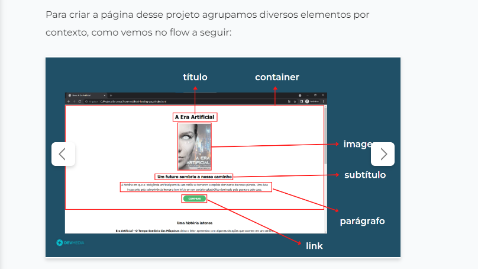

# my first responsive website test project

__________________________________________

 ## Projeto clinica medica site responsivo

 _________________________________________ 

## Descrição em Português

_________________________
  Este projeto foi baseado em um layout entregue no projeto passo a passo na plataforma de ensino DevMedia, O formato Passo a passo  funciona da seguinte forma, é passado uma imagens do Produto final e em seguinte tem passos a serem conquistados com cards com pequenas descrições do que deve ser feito, sem muitos detalhes sobre o código com o incentivo para que o estudante crie o próprio código, o objetivo e chegar ao mesmo resultado ao final

  ## Description in English

  _________________________
This project was based on a layout delivered in the step-by-step project on the DevMedia teaching platform. that must be done, without much detail about the code with the incentive for the student to create their own code, the objective and to reach the same result in the end

 Na imagem acima, temos um exemplo de como são os Cards explicativo
 

I modified some things in the project, to learn and give it a personal touch, such as colors, fonts and even some ways of how the site responds.
  
Modifiquei algumas coisas no projeto, para aprender e dar um toque pessoal, como cores, fontes e até algumas formas de resposta do site.

### Demonstration of how the site turned out, and the responsiveness:

## responsiveness image

### technologies used:

* HTML 
* CSS3

### Designer tools used:

* Adobe color
* Google Fonts
* Figma

